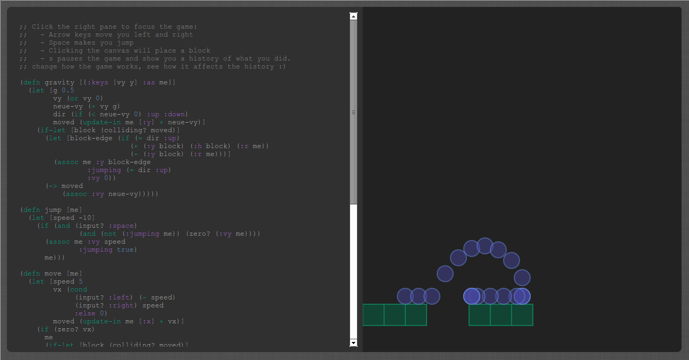

An implementation of Bret Victor's neat live game editor in Clojurescript.



Uses [LightTable](http://lighttable.com/) to live edit the code via the browser.

## Usage

**Works best in Chrome. It runs in FF, but the mouse events don't work**

```bash
lein run
```

Then visit <http://localhost:8074>.

__If you get the "can't recur here" error:__

For some reason on second run the cljs compiler gets AOT compiled and screws everything up. If you get an error when you run, simply

```bash
rm -rf classes/cljs/
```

Or, for some people this works:

```bash
rm -rf target/classes/cljs
```

## License

Copyright (C) 2012 Chris Granger

Distributed under the Eclipse Public License, the same as Clojure.

